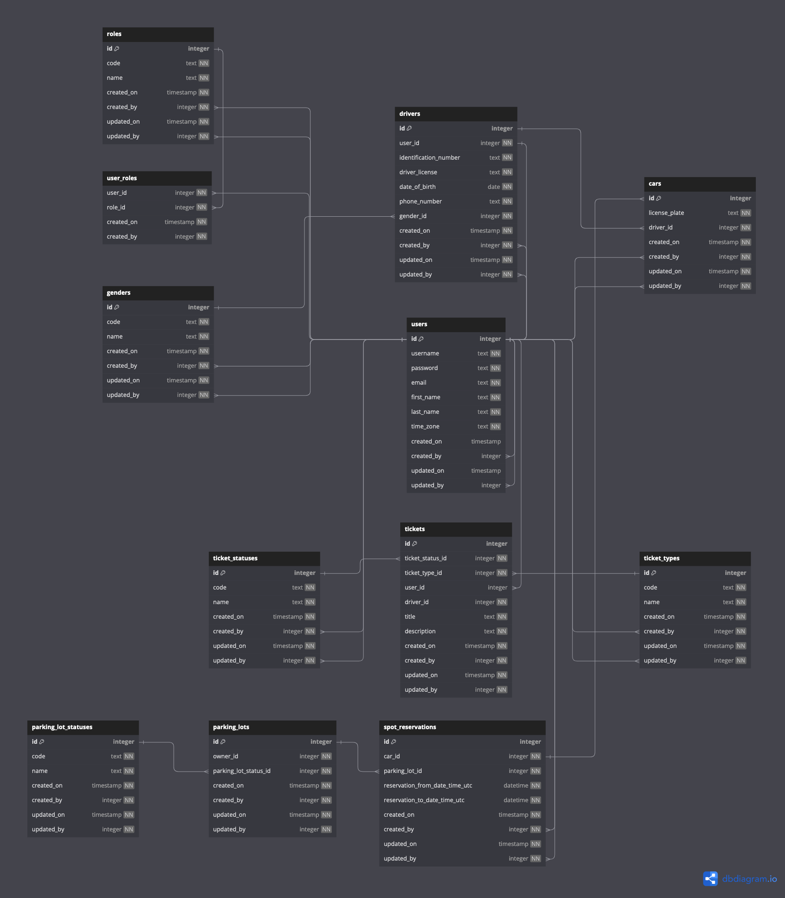

# Spot Secure - Your Spot, Your Way (API)

## Promise

Welcome to SpotSecure, your go-to solution for hassle-free parking lot reservations. In a world where time is precious and convenience is key, SpotSecure is designed to streamline your parking experience, ensuring a secure and seamless process.

This project is currently being designed, so a lot of things might change during the next weeks or months.

## Used Stack

**Back-end:** C#, PostgreSQL

## Schema

### Users

Holds all the users that register in the website. Each user can have one or multiple roles.

### Drivers

Holds all the drivers that have requested their spot in the parking lot. The driver needs to have an account created first.

### Parking Lots

Holds all the parking lots that the owner own. The idea is that if the owner owns multiple parking lots, they can setup in the website and the driver can choose where to park their car.

### Spot Reservations

Holds all the spot reservations that a driver can make.

### Tickets

Holds all the support tickets that the users can submit.

## App Setting

You'll need the following variables setup in appsettings.json.

- ConnectionStrings - SpotSecureDb: Host=127.0.0.1;Database=dbName;

## Feedback

If you have any feedback, please feel free to open a ticket and I'll review it shortly!

## Author

- [@tiagossa1](https://github.com/tiagossa1)
